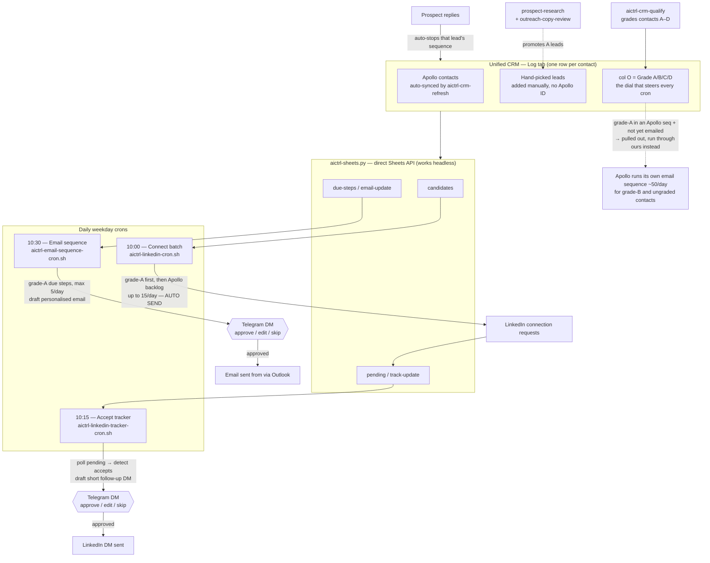

# aictrl Outreach — Process Flow

One unified CRM (the `Log` tab), one priority dial (**col O grade**), three daily weekday crons. Connects are the only fully-automatic step; every **message and email is drafted only and waits for approval in the operator's Telegram DM** (never the group, never auto-sent).

## Rules encoded
- **LinkedIn connect priority = grade A.** Our hand-picked A leads connect ahead of the Apollo task backlog; once connected, the cron falls through to Apollo's queue.
- **Our email cron = grade A only, ≤5/day** (Apollo handles ~50/day for B/ungraded). Never double-emails: rows whose `Email Status` starts "skip" (already in an Apollo email sequence) are excluded.
- **A-grade contact already in an Apollo email sequence:** if Apollo hasn't emailed them yet, remove from Apollo and run our personalised sequence; if Apollo already emailed, leave them with Apollo.
- **Approval:** LinkedIn follow-up DMs and all emails are drafted to the Telegram DM (`<YOUR_TELEGRAM_DM_CHAT_ID>`) for approve/edit/skip. Connects are the only auto step.
- **All CRM I/O goes through `aictrl-sheets.py`** (direct Sheets API) because the Google Sheets MCP can't authenticate in a headless cron.
